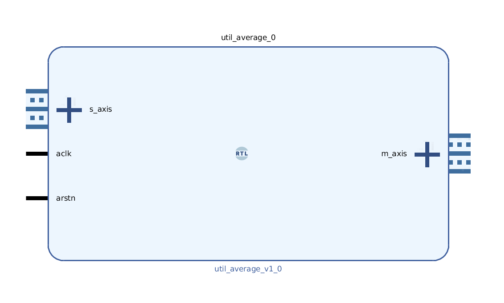

# AXIS MOVING AVERAGE
## Average input data using sliding window method
---

   author: JayConvertino  
   
   date: 2023.02.01
   
   details: Provides methods of computing an average upon a input data. Sliding window method.
      
   license: MIT   
   
---

### Dependencies
#### Build
  - AFRL:utility:helper:1.0.0
  
#### Simulation
  - AFRL:simulation:axis_stimulator
  - AFRL:simulation:clock_stimulator

### IP USAGE
#### Parameters

* BUS_WIDTH : DEFAULT : 1 : Width of the AXIS bus in/out.
* WEIGHT    : DEFAULT : 1 : Divisor for the average. Will only work with powers of 2 (1, 2, 4, 8, 16... etc)

### COMPONENTS
#### SRC

* axis_moving_average.v
  
#### TB

* tb_axis.v
* in.bin
  
### fusesoc

* fusesoc_info.core created.
* Simulation uses icarus to run data through the core.

